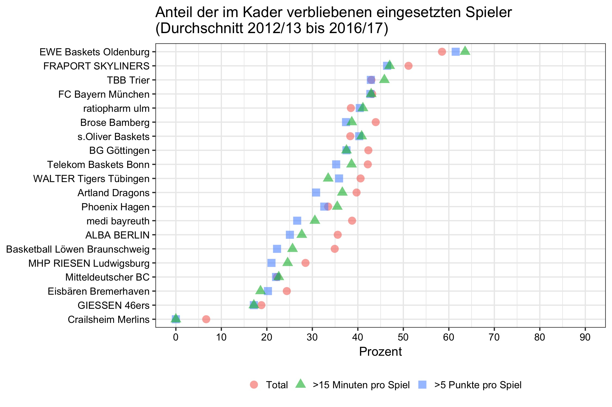

# "Will he stay or will he go?"

Die [Telekom Baskets Bonn](https://www.telekom-baskets-bonn.de) veröffentlichten jüngst einen [Artikel](https://www.telekom-baskets-bonn.de/presse/background/fluktuation.html), in dem der prozentuale Anteil der Spieler berechnet wurde, die nach einer Saison im selben Verein verblieben.

Ich habe diese Zahlen versucht zu replizieren und außerdem zu berechnen, wie hoch der Anteil der verbliebenen Spieler ist, die im Schnitt über 15 Minuten pro Spiel gespielt haben oder mehr als 5 Punkte erzielt haben. Diese Werte sind nämlich ebenfalls bedeutend, um zu verstehen, ob eher "Bankdrücker" oder "Leistungsträger" gehalten wurden.

Dieses Repository beinhaltet die genutzen [Rohdaten](raw_data), webscraped von der [BBL-Website](http://easycredit-bbl.de), das [Skript](code/01_recode_and_merge), das für die Umwandlung und Berechnungen geschrieben wurde, und den finalen [Datensatz](data/bbl_2012-2017) auf der Ebene von Spieler und Saison. Kommentare und Hinweise auf mögliche Fehler sind jederzeit willkommen. Schreibt mir einfach eine [E-Mail](mailto:mullers@tcd.ie).

Interessanterweise weichen meine Zahlen von denen der Baskets ab (s. Anmerkungen unten). Kenner der jeweiligen Vereine können [hier](data/bbl_2012-2017) gerne nachschauen, ob bei ihrem jeweiligen Verein die Spieler korrekt kodiert wurden (ich habe dies für meine Telekom Baskets und zufallsweise für andere Vereine gecheckt). Hierbei ist die Spalte `stayed` zu beachten: Wenn `stayed` den Wert 1 hat, heißt dies, dass der Spieler auch in der Vorsaison bei dem selben Club gespielt hat. Eine 0 impliziert, dass der Spieler neu verpflichtet wurde. 

Ein paar Anmerkungen zur Berechnung:
* Es sind lediglich Spieler einbezogen, die über die ganze Saison hinweg mindestens eine Minute auf dem Feld standen.
* Bei Spielern, die während der Saison innerhalb der BBL wechselten (in den 5 Saisons insgesamt 24 Spieler), wurde der Club ausgewählt, für den ein Spieler mehr Spiele absolviert hat.
* Wenn ein Club aufgestiegen ist, beinhaltet die Seite der BBL keine Angaben über Statistiken aus der Vorsaison. Teams in der ersten Saison nach dem Aufstieg sind daher nicht berücksichtigt.
* Der Gesamtanteil von verbliebenen Spielern pro Saison bezieht sich nur auf die Anzahl an Saisons, die dieser Verein zwischen 2012 und 2017 in der BBL gespielt hat. 
