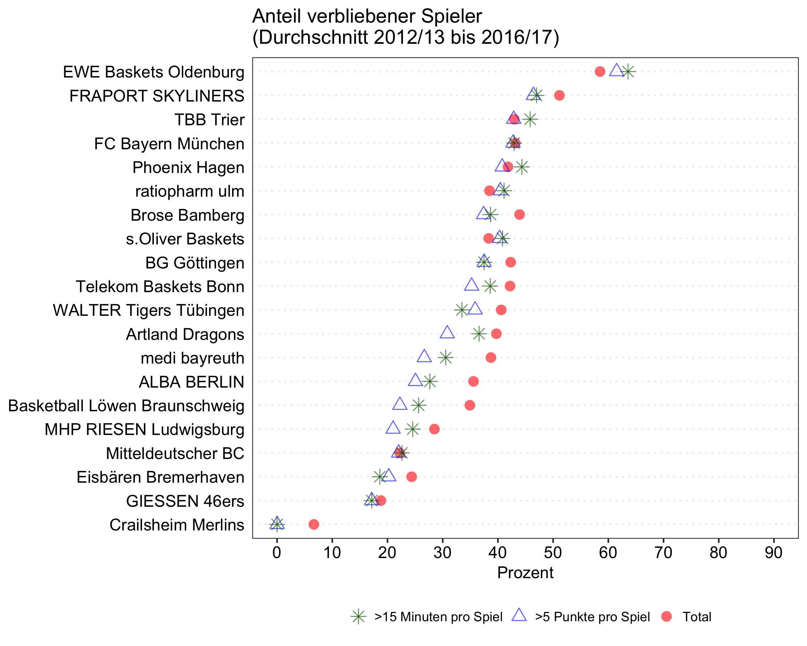

# "Will he stay or will he go?"

Die [Telekom Baskets Bonn](https://www.telekom-baskets-bonn.de) veröffentlichten jüngst einen [Artikel](https://www.telekom-baskets-bonn.de/presse/background/fluktuation.html), in dem der prozentuale Anteil der Spieler berechnet wurde, die nach einer Saison im selben Verein verblieben.

Ich habe diese Zahlen versucht zu repliziert und außerdem zu berechnen, wie hoch der Anteil der verbliebenen Spieler ist, die im Schnitt über zehn Minuten pro Spiel gespielt haben oder mehr als fünf Punkte erzielt haben.

Dieses Repository beinhaltet die genutzen [Rohdaten](raw_data), webscraped von der [BBL-Website](http://easycredit-bbl.de), das [Skript](code/01_recode_and_merge), das für die Umwandlung und Berechnungen geschrieben wurde und den finalen [Datensatz](data/beko_bbl_2012-2017) auf der Ebene von Spieler und Saison. Kommentare und Hinweise auf mögliche Fehler sind jederzeit willkommen. Schreibt mir einfach eine [E-Mail](mailto:mullers@tcd.ie).

Ein paar Anmerkungen zur Berechnung:

